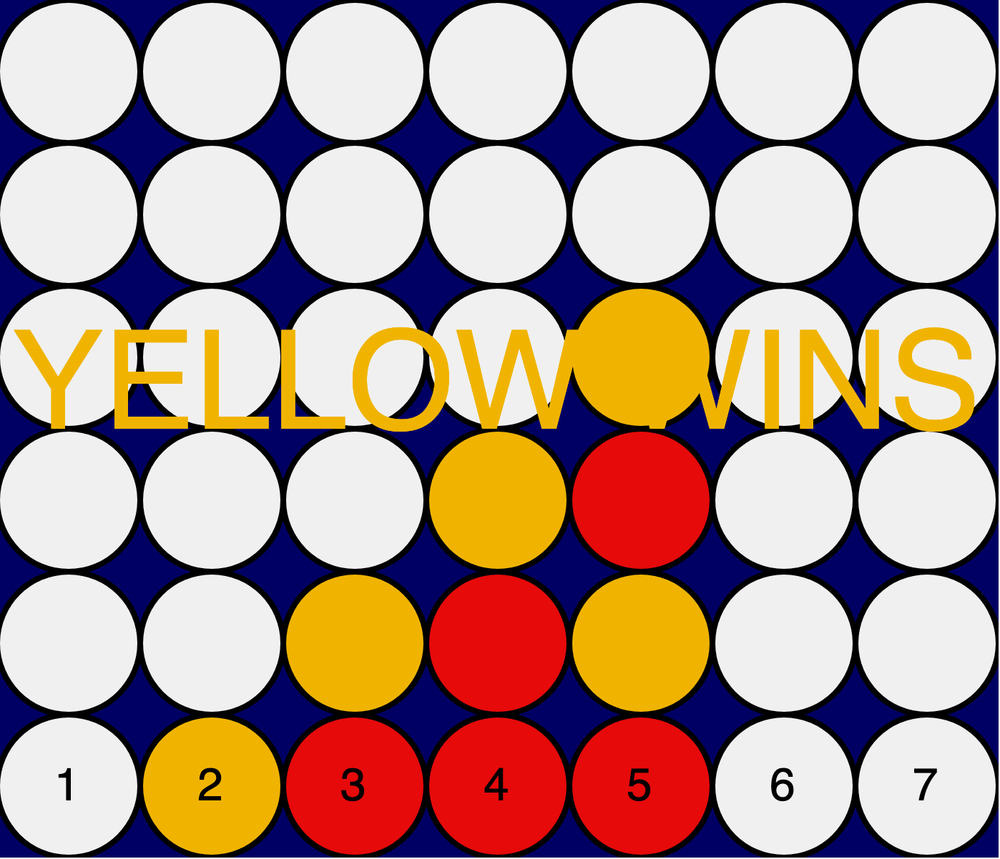

# Connect Four Game in Javascript (P5.JS)
##### Author: Alessandro Sebastianelli, alessandro.sebastianelli1995@gmail.com

[Connect four wiki page](https://en.wikipedia.org/wiki/Connect_Four)
# Tutorial
Each player can play by typing the number of columns in which to insert the disc. The game ends when a player manages to align four disks of the same color in a column, in a row or along the vertical.

