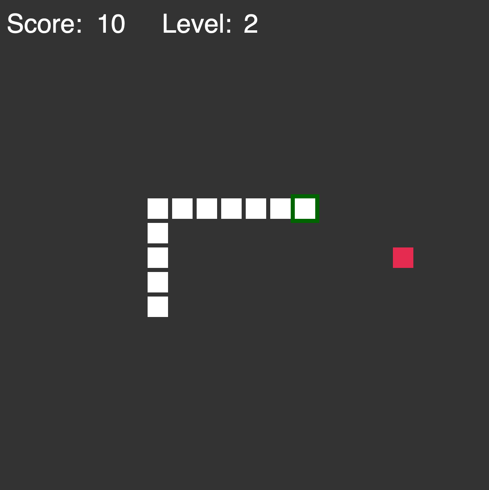
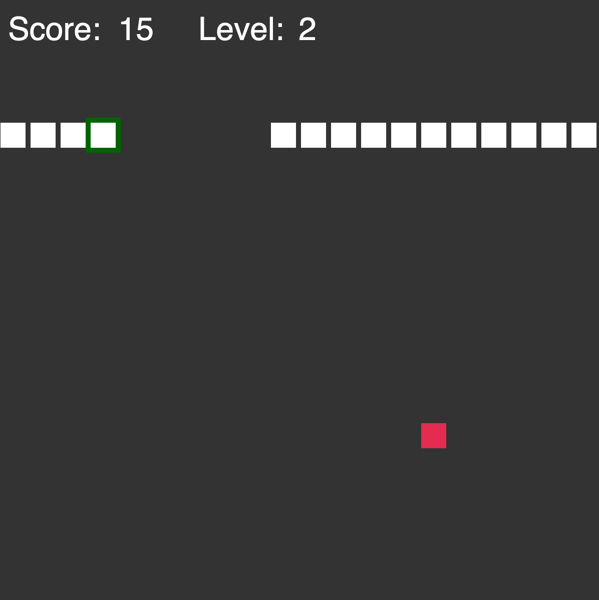

# Snake Game in Javascript (P5.JS)
##### Author: Alessandro Sebastianelli, alessandro.sebastianelli1995@gmail.com

[Snake wiki page](https://en.wikipedia.org/wiki/Snake_(video_game_genre))
# Tutorial
The player can control Snake using the arrows and can pause the game by pressing any other buttons.

## Teleporting 

By the default the teleporting is not allowed.


The teleporting can be allowed in the code by changing the flag: 
```javascript
let tp = true;
```


